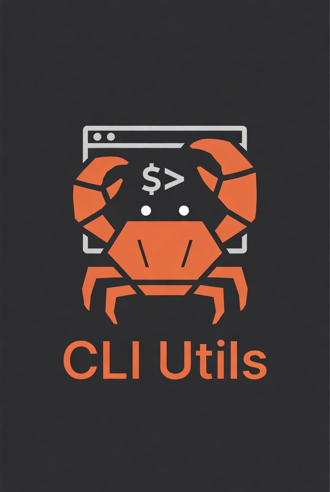

<div align="center">
    
    <h1>rust-utils</h1>
    <p style="max-width:700px;margin:0 auto;">A small collection of Rust command-line utilities and example crates used for development, experimentation, and distribution. Each CLI lives in <code>crates/</code> and is published as prebuilt binaries in the project's Releases.</p>
    <p><strong>Prebuilt CLIs:</strong> See the Releases tab on GitHub to download prebuilt binaries for Windows, macOS and Linux.</p>
</div>

---

## About

- **What this repo contains:** multiple small Rust CLIs and helper crates under `crates/` and root utilities under `rust-utils/`.
- **How to get the CLIs:** source builds via Cargo or download prebuilt binaries from the Releases tab on GitHub (prebuilt installers/archives are attached to each release).
- **Quick start:** build locally with `cargo build --release` or run individual crates with `cargo run -p <crate>` from the workspace root.

---

## Additional notes

## Initialize New Crate:

```bash
# create new folder in `/crates` and run
cargo init
```

Add new memeber to main `Cargo.toml`:

```txt
[workspace]
resolver = "2"
members = [
        "crates/ls",
        "crates/tr",
]

```

## Run Crate Locally:

```bash
# run crate from root dir
cargo run -p tr
cargo watch -w crates/tr -x "run -p tr"

# or cd in the crate
cargo run -- ./app -sSn
cargo watch -x run -- ./app -sSn
```

## Build Crates:

```bash
cargo build
cargo build --release   # more optimized for release
```

## Add dependencies

```bash
cargo add colored -F feature1,feature2
```

Then updated crate that requies it

```txt
# ~/crates/tr/Cargo.toml

[dependencies]
colored.workspace = true
```
